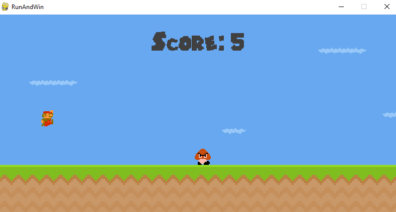

# Super Mario Bros

Este é um jogo desenvolvido em Python utilizando Pygame, onde o jogador controla o famoso personagem Mario e deve correr e evitar obstáculos o máximo possível.

# Objetivo

O objetivo do jogo é alcançar a maior pontuação possível, evitando obstáculos e inimigos ao longo do percurso. Quanto mais longe o jogador chegar, maior será sua pontuação.

# Funcionalidades

- Controle do Personagem: O jogador pode controlar Mario usando as teclas direcionais para correr para a direita ou para a esquerda, e a tecla de espaço para pular.
- Evitar Obstáculos: Mario precisa evitar obstáculos como buracos, poços, inimigos e outros perigos que aparecem no caminho.
- Pontuação: O jogo mantém a pontuação do jogador, que aumenta à medida que Mario avança na fase.

# Executando o Jogo
Para executar o jogo, certifique-se de ter o Python e o Pygame instalados. Você pode executar o jogo usando o seguinte comando:

python main.py

# Imagens

# Autor
Este jogo foi desenvolvido por Eduardo Abrahão.
